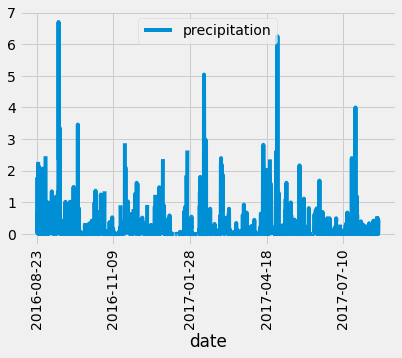
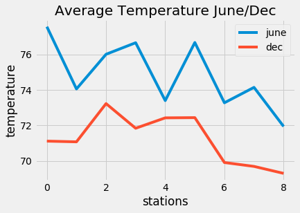
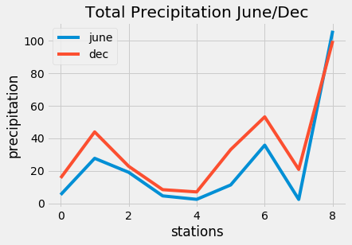

# surfs-up

## Overview:

  Idea is to start a Surf n Shake shop in Hawaii to serve the locals and tourists, it's not an easy job due to the investment need. Decided to reach out to W. Avy for the investment, since he had a bad experience with the previous venture he wanted some kind of analysis on the weather.
  
## Analysis

  Got the SQLite data from W.Avy for the analysis. Using SQLAlchemy, Pandas, Flask we started the work to look at the weather data. Flask was used to present the analysis on the web for easy consumption of the analysis.
  
  Using SQLAlchemy reflection we looked at Measurement and Station data. We have temperature, precipitation data from 9 stations around Oahu Hawaii using this data lets figure out the timeframe good for starting the Surf 'n' Shake store. Here is the snapshot of precipitation for the time period from 2016, Aug 23 (a year before the last vacation) 
  
## Challenge Overview:

  Compare Temperature and Precipitation statistical data for June and December. Provide some recommendations based on the data and its analysis
  
## Analysis:

  December seems to be comparatively cooler than June where the temperature ranges between 59 - 79 degree Celsius with average in 71 degree Celcius, while June temperature ranges between 67 - 82 degree celcius with average in 75 degree celcius.
  
  On top of temperature rain also plays a major role in the success of the business, average precipitation in June is 24 cms while December seems to be rainy with 34 cms.
  
  With summer being the popular season not only for the families but also based on both temperature and precipitation, it would be ideal to open Surf 'n' Shake store during June
